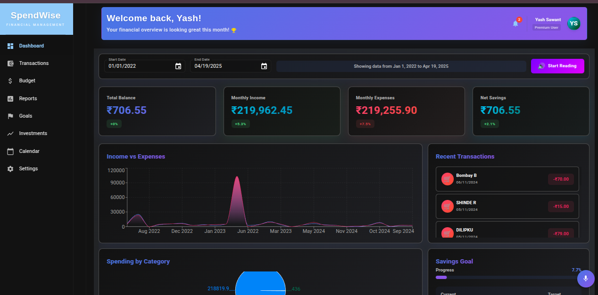
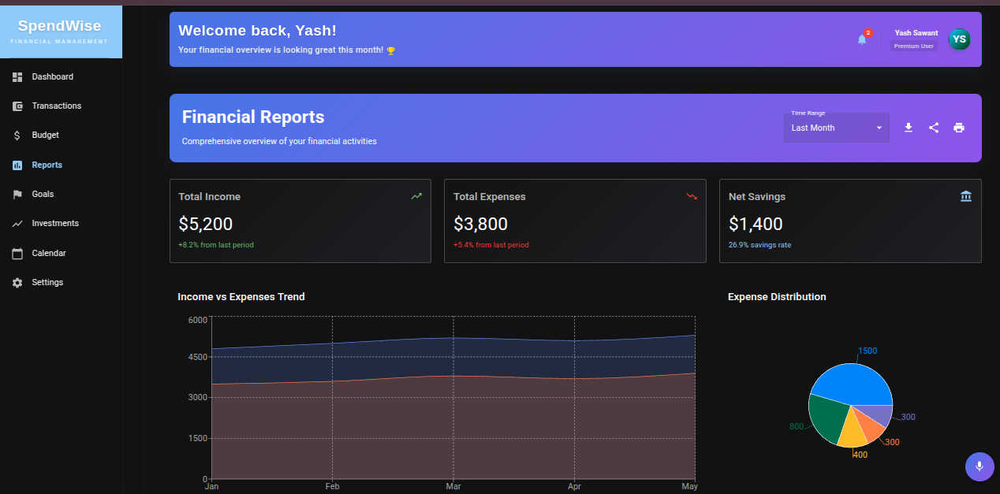
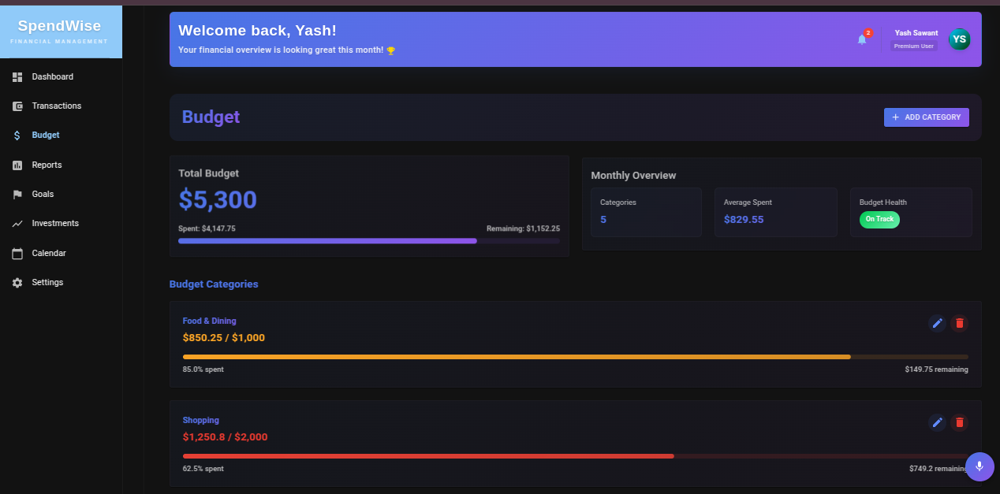

# SpendWise: Smart Personal Finance Management System

<div align="center">
  
  
  
  
  
  
</div>

## 🌟 Overview

SpendWise is a comprehensive personal finance management system that combines modern web technologies with machine learning to provide intelligent expense tracking, budget management, and financial insights. The application features voice-enabled expense entry, smart categorization of expenses, and detailed financial analytics.

## ✨ Key Features

- 🎯 **Smart Expense Tracking**
  - Voice-enabled expense entry
  - Automatic expense categorization using ML
  - Receipt scanning and processing
  
- 📊 **Advanced Analytics**
  - Interactive dashboards
  - Spending pattern analysis
  - Predictive insights
  
- 💰 **Budget Management**
  - Custom budget creation
  - Category-wise budget tracking
  - Real-time alerts and notifications
  
- 🤖 **ML-Powered Features**
  - Expense categorization
  - Spending pattern recognition
  - Anomaly detection
  
- 🔒 **Security**
  - Secure user authentication
  - Encrypted data storage
  - Privacy-focused design

## 🛠️ Technology Stack

### Frontend
- React.js with TypeScript
- Vite for build tooling
- Modern UI components
- Responsive design

### Backend
- Django REST Framework
- SQLite database
- JWT authentication
- API documentation

### Machine Learning
- Python-based ML pipeline
- Jupyter notebooks for analysis
- Scikit-learn for modeling
- Natural Language Processing

## 📸 Screenshots

<div align="center">
  
  <p><em>Main Dashboard View</em></p>
  
  
  <p><em>Analytics and Insights</em></p>
  
  
  <p><em>Budget Management Interface</em></p>
</div>

## 🚀 Getting Started

### Prerequisites
- Python 3.8 or higher
- Node.js 14 or higher
- npm or yarn

### Backend Setup
```bash
cd backend
python -m venv venv
source venv/bin/activate  # On Windows: .\venv\Scripts\activate
pip install -r requirements.txt
python manage.py migrate
python manage.py runserver
```

### Frontend Setup
```bash
cd frontend
npm install
npm run dev
```

### ML Components Setup
```bash
cd ML
pip install -r requirements.txt
```

## 📖 Documentation

Detailed documentation is available in the following sections:
- [API Documentation](docs/api.md)
- [ML Model Documentation](docs/ml-models.md)
- [User Guide](docs/user-guide.md)

## 🤝 Contributing

We welcome contributions! Please see our [Contributing Guidelines](CONTRIBUTING.md) for details.

## 📄 License

This project is licensed under the MIT License - see the [LICENSE](LICENSE) file for details.

## 👥 Team

- [YASH SAWANT] - Full Stack Developer
- [VIHAAN SHINE] - ML Engineer
- [PRATHAM SHIRBATE] - UI/UX Designer

## 📞 Contact

For any queries or support, please reach out to:
- Email: your.email@example.com
- GitHub Issues: [Create an issue](https://github.com/SytherAsh/SpendWise/issues)

---

<div align="center">
  Made with ❤️ by the SpendWise Team
</div> 